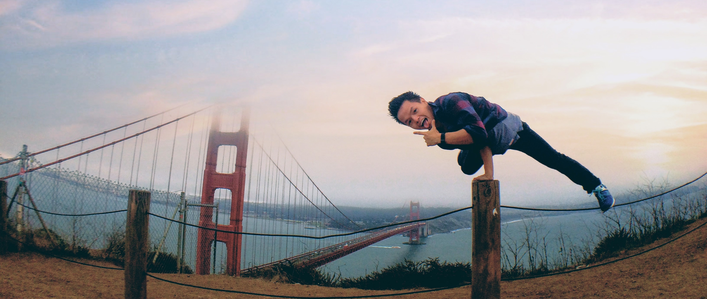

Hey there, thanks for stopping by 😉. Hope you doing well.

### About myself:
* ML Engineer by day.
* Human being / viber by night. 😆
* Grew up in Vietnam, and calling the Bay Area my second home now 🏡.

#### Current hobbies:
* Explore new cultures, new places and new perspectives. I enjoy solo backpacking, and spontaneous getaways. 
* Learn new languages (Spanish for now).
* Attend music festivals, and concerts.

### 🔥 Things I found that make myself happy, excited and content
* Quality time with my loved ones (my mom, my friends and hopefully in the future, my soulmate)
* Exercise daily.
* Real human interactions.
* Intriguingly new ideas / concepts.
* Music + moving my body, aka dancing.

### 🚩 Things I found that make myself feel miserable
* Too focused on monetary net worth. I both believe personal finance and happiness diminishing return.
* Too focused on the world news and politics or things that are outside of my controls.
* Conform to social norms and expectations that don't fit my personalities, and keep up with the Joneses.  

### 🚀 Things I want to do in the future
* Create X that brings massive values to the community, and people around me. X could be anything. Joining a positive-impact startup, business.
* Ability to effectively control my attention and intention.

Cheers, 🍻
Dat ☺️

### Random links
- My *parsable* resume:
https://resume.dat.works/
- My dis-organized yet functional projects 😉:
https://github.com/datlife

